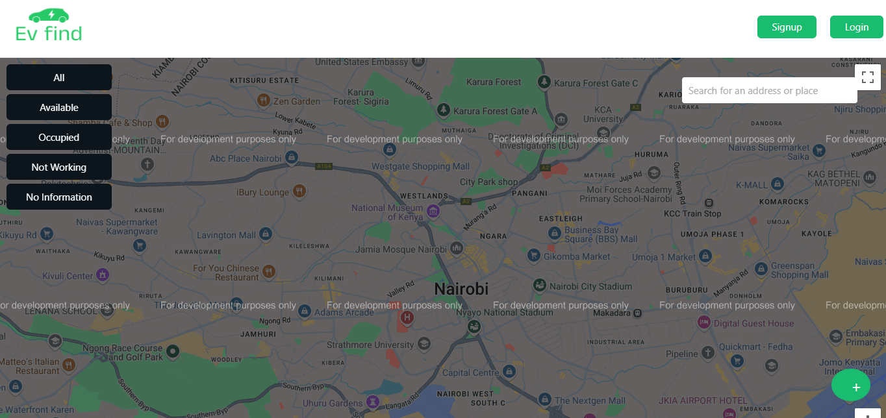

⚡ EV Station Search and Reservation System
An intuitive web application that simplifies the process of locating, reserving, and managing EV charging stations. Designed to enhance the user experience for electric vehicle owners, this system combines real-time updates, dynamic reservations, and detailed reports to create a seamless charging experience. 🚗🔌

🌟 Features
🔍 EV Station Search
Search for EV stations by location using an interactive map.
View station availability, operational status, power output, and user ratings.
📍 Real-Time Map Integration
Integrated with Leaflet for interactive maps.
Displays custom markers for station statuses: Available, Occupied, Not Working, or No Information.
📊 Reservation Management
Real-time reservation tracking with automatic updates.
Allows users to reserve stations, with reservations dynamically stored in their profiles.
📈 Detailed Reports
Generate user-specific reports, including total reservations, total charging duration, and station-specific usage summaries.
Download reports in CSV format for detailed analysis.
🔒 Secure User Authentication
Implemented with token-based authentication for secure access to features.
User sessions are managed efficiently with robust backend handling.
🎉 User-Friendly Interface
Built with React for a modern and responsive UI.
Integrated Toastify for interactive error and success notifications.
🛠️ Tech Stack
Frontend:
React: For creating an intuitive and dynamic user interface.
Axios: For seamless communication with the backend API.
Toastify: For responsive notifications (errors, successes, etc.).
Leaflet: For interactive map integration.
Backend:
Node.js & Express: For handling API endpoints and server logic.
MongoDB: For efficient and scalable data storage.
JSON Web Tokens (JWT): For secure authentication.
Mongoose: For schema-based MongoDB interaction.

🚀 Installation and Setup
Prerequisites:
Node.js (v16 or higher)
MongoDB instance (local or cloud, e.g., MongoDB Atlas)
Steps:
Clone the repository:

bash
Copy code
git clone https://github.com/yourusername/ev-station-search.git
cd ev-station-search
Install dependencies:

bash
Copy code
# For backend
cd backend
npm run dev

# For frontend
cd ../frontend
npm install
Set up environment variables:

In the backend folder, create a .env file with the following:
env
Copy code
PORT=5000
MONGO_URI=your_mongo_connection_string
JWT_SECRET=your_jwt_secret
In the frontend folder, create a .env file with:
env
Copy code
REACT_APP_MAP_API_KEY=your_google_maps_api_key
Start the application:

bash
Copy code
# Start backend
cd backend
npm run dev

# Start frontend
cd ../frontend
npm start
Open your browser and visit http://localhost:3000.

📂 Folder Structure
arduino
Copy code
ev-station-search/
│
├── backend/
│   ├── controllers/
│   ├── models/
│   ├── routes/
│   ├── utils/
│   └── server.js
│
├── frontend/
│   ├── public/
│   ├── src/
│   │   ├── components/
│   │   ├── pages/
│   │   ├── utils/
│   │   └── App.js
│
└── README.md
🤝 Contribution
We welcome contributions to make this project better! Here's how you can contribute:

Fork the repository.
Create a feature branch:
bash
Copy code
git checkout -b feature/your-feature-name
Commit your changes and push:
bash
Copy code
git commit -m "Add your message"
git push origin feature/your-feature-name
Open a Pull Request.

🎨 Screenshots
Home Page:
An intuitive map interface for searching EV stations.

Secure Authentication: 

Reservation System:
Effortlessly reserve a station and manage bookings.

Reports:
Generate detailed reports on usage and reservations.

📌 Roadmap
 Add more global search functionality.
 Include charging cost estimation.
 Real-time notifications for station updates.
 AI-based station recommendations based on usage history.
